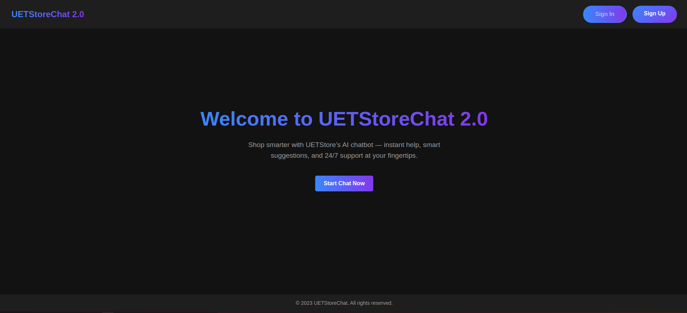
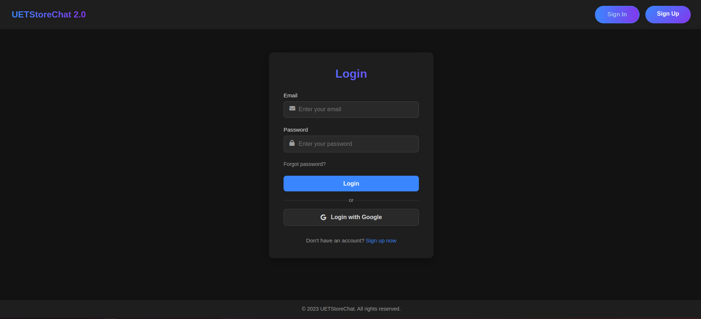
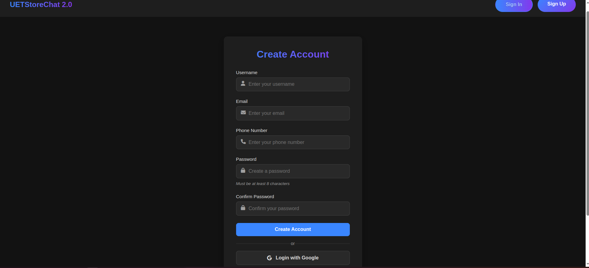
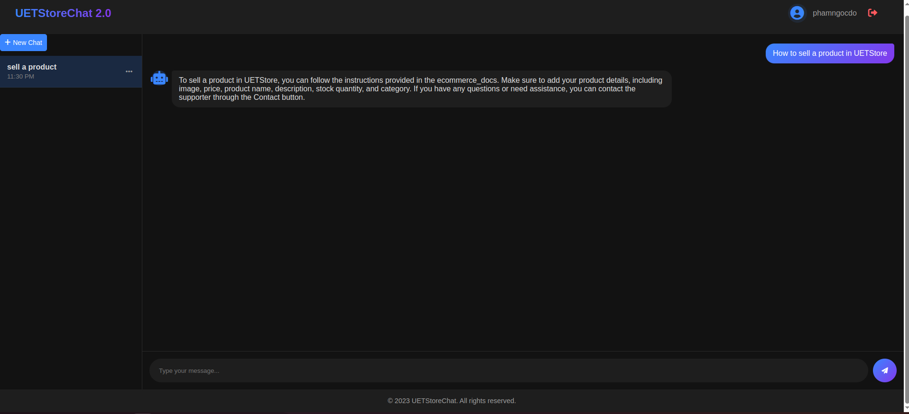
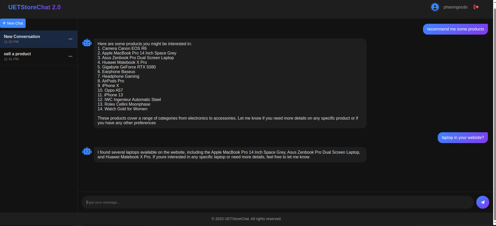

# Simple-chatbot-for-Ecomerce-Website


## Introduction
This is version 2.0 of the chatbot developed for UETStore, an e-commerce platform (you can explore the project via the [Github](https://github.com/Thanhlam43k4/ecommerce-website) and [Figma](https://www.figma.com/design/xPDkX9WSgpFdgxWyE12h7T/Ecommerce-Web---Group-11-s-Project?t=SlOD9XFq1hBBfJRH-0) ). The chatbot has been upgraded into an AI-powered agent with a modern, user-friendly chat interface. It is designed to assist users by answering questions related to the UETStore website, available products, and how to navigate and use the platform effectively.

User interface:








## Build with
- **Languages:** Python3, Javascript
- **UI:** HTML, CSS
- **Frameworks:** Langchain, FastAPI
- **Databases:** MySQL, MongoDB
- **Tools:** Docker, Postman
- **Services:** GoogleOauth2, Openrouter (use gpt3.5 model)

## Set up

### Get Google OAuth Credentials
#### 1. Go to the [Google console cloud](https://console.cloud.google.com/)
#### 2. Create a new project (or select an existing one)
#### 3. Navigate to APIs & Services > Credentials
#### 4. Click Create Credentials > OAuth 2.0 Client ID
#### 5.Choose Web Application
#### 6. Set the following: Authorized redirect URI: `http://localhost:3000//auth/google/callback`
#### 7. Copy your Client ID and Client Secret into the .env file

### Get OpenRouter Key
#### 1. Visit: [OpenRouter](https://openrouter.ai/)
#### 2. Sign in and go to: [Keys](https://openrouter.ai/keys)
#### 3. Generate a new API key
#### 4. Add it to the .env file under OPENROUTER_API

### Run app
First, you clone this project by Git:
``` bash
git clone https://github.com/phamngocdo/Simple-chatbot-for-Ecomerce-Website.git
cd Simple-chatbot-for-Ecomerce-Website.git
```
Next step, you need to create a .env file:
``` .env
MYSQL_HOST=localhost
MYSQL_USER=root
MYSQL_NAME=uet_store
MYSQL_PASS=type_your_password here
MYSQL_PORT=3306

MONGO_URI=mongodb://localhost:27017
MONGO_DB_NAME=chat_messages

PORT=3000

SECRET_KEY=type_your_random_key(for authentication)

GOOGLE_CLIENT_ID=type_your_client_id
GOOGLE_CLIENT_SECRET=type_your_client_secret

OPENROUTER_API=type_your_key

```

Install docker if you don't have, then:
```bash
docker compose up --build

```
To stop app:
```bash
docker compose down
```

## License
Distributed under the MIT License. See LICENSE.txt for more information.


## Contact
Email - [ngocdo992k4@gmail.com](mailto:ngocdo992k4@gmail.com)  
Github - [phamngocdo](https://github.com/phamngocdo) 